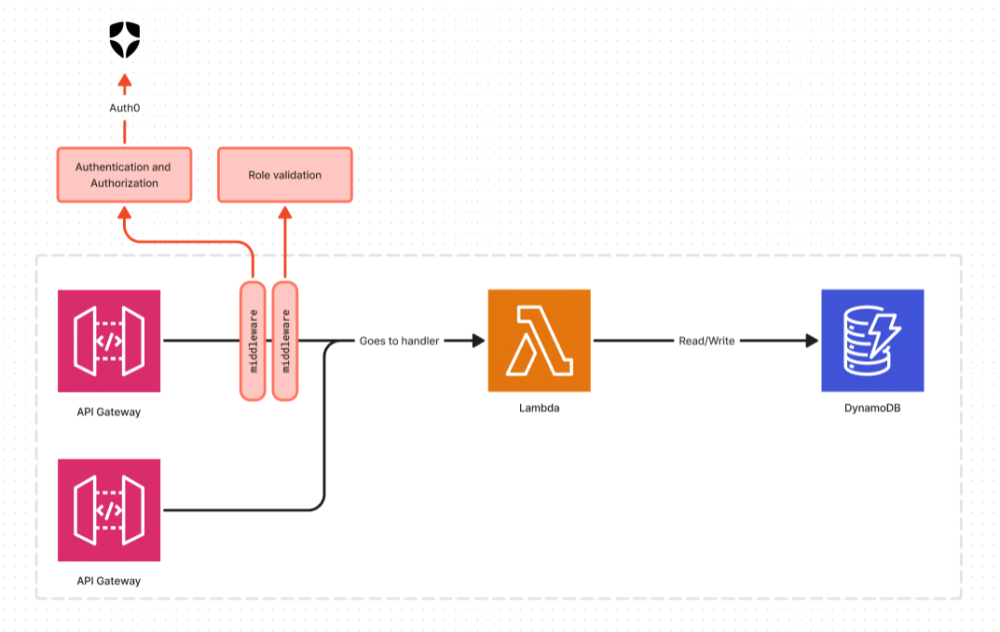

# Curso Serverless Framework

## Tecnologias a utilizar:

- 🟢 NodeJS
- 🟢 TypeScript
- 🟢 DynamoDB
- 🟢 API Gateway
- 🟢 Lambda function
- 🟢 Middy
- 🟢 Auth0

## Como construiremos nuestra API:

_Desarrrollado por @codrrdev💛_
